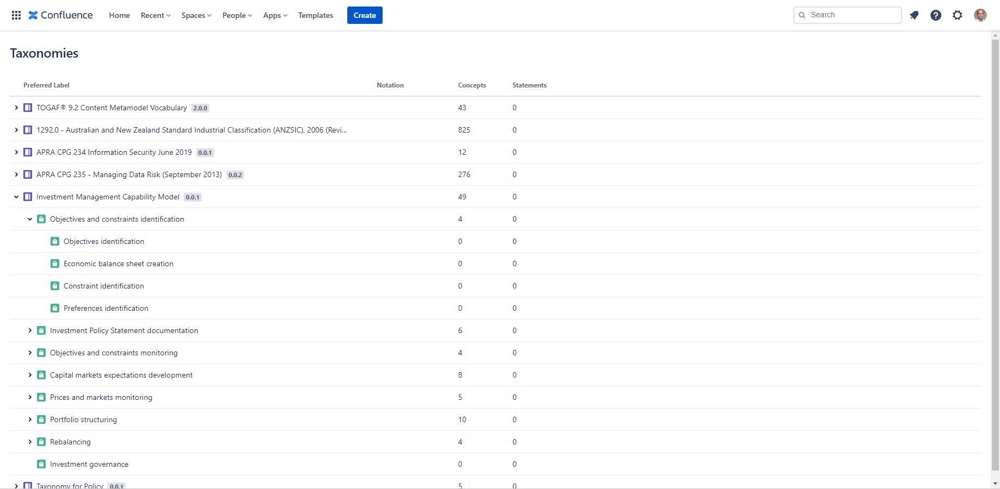
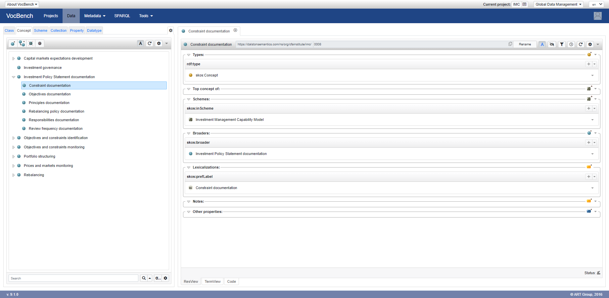

# Investment Management Capbilities Taxonomy

Investment Management Capability Model is a taxonomy is based on [CFA Program Curriculum 2022 Level III Volume 1 Reading 5](https://www.cfainstitute.org/en/programs/cfa/exam/level-iii) that describes capabilities of an investment management firm.

Use it with [Taxonomies for Confluence](https://dalstonsemantics.com/services/taxonomies-for-confluence/) to track alignment of enterprise architecture or risk and compliance documentation in [Confluence](https://www.atlassian.com/software/confluence).

Developed with [Simple Knowledge Organization System (SKOS)](https://www.w3.org/2004/02/skos/) this taxonomy can also be imported and published using many [controlled vocabulary tools](https://github.com/gbv/bartoc.org/wiki/Software-for-controlled-vocabularies).

